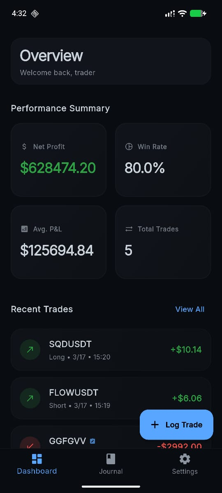
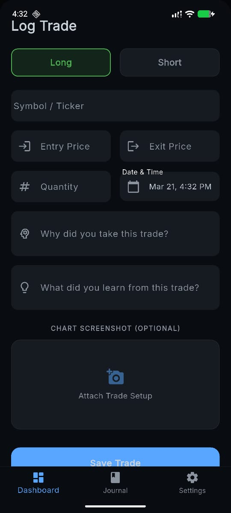
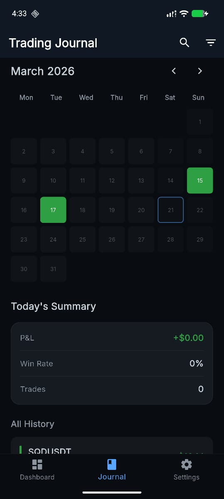
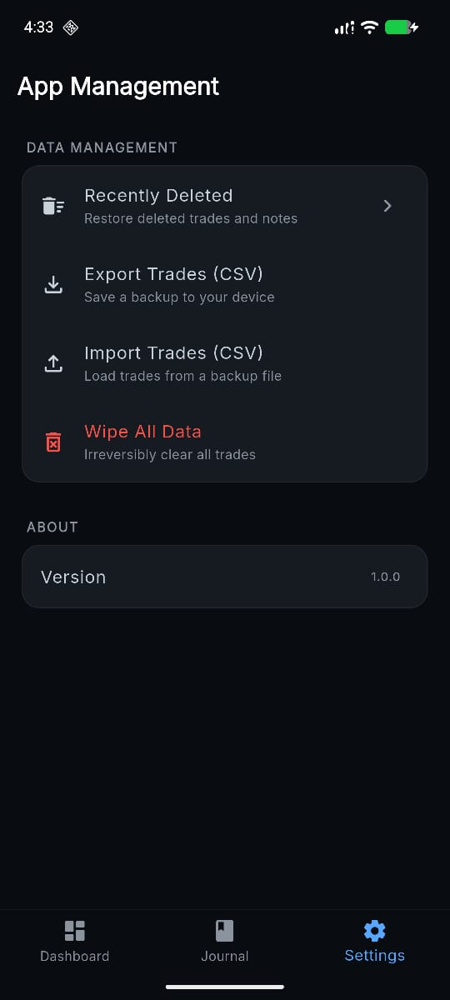

📊 Trading Journal

A clean and simple trading journal designed to help traders track their trades, analyze performance, and improve decision making over time.

Features

Add and manage trades

Track profit and loss

View trade history

Calendar view of trades

Responsive interface

App Management

Recently Deleted

Export trades as CSV

Import trades from CSV

Wipe all data

Screenshots

Add screenshots below

Tech Stack

Flutter

Dart

Note

Built for tracking trades. Use alongside proper risk management.
